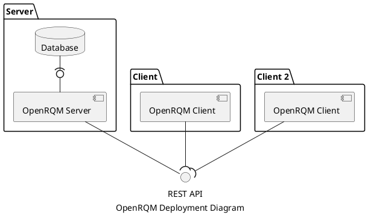
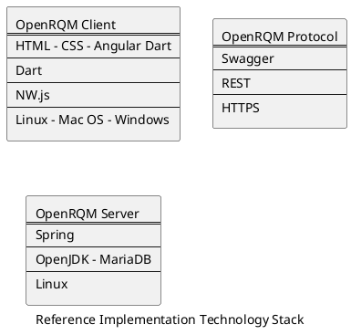

# OpenRQM System Architecture

This repository contains the architecture of the OpenRQM System.

- [OpenRQM System Architecture](#openrqm-system-architecture)
  - [System Overview](#system-overview)
  - [Reference Implementation Technology Stack](#reference-implementation-technology-stack)
    - [Reasons for selection of technologies](#reasons-for-selection-of-technologies)
  - [API specification](#api-specification)

## System Overview

The OpenRQM System contains of a server which exposes the OpenRQM REST API and several clients which use it.

The OpenRQM project specifies only the REST API and provides a server and client implementation to demonstrate it.

This way many different implementations can be created which are interoperable.

## Reference Implementation Technology Stack

### Reasons for selection of technologies

| Technology               | Reason                                                                                                                                                                                                                           |
| ------------------------ | -------------------------------------------------------------------------------------------------------------------------------------------------------------------------------------------------------------------------------- |
| Linux - Mac OS - Windows | As the reference implementation the application should be runnable from all desktop operating systems for evaluation. Since classical requirements management is done via desktop PCs mobile operating systems are not in focus. |
| NW.js                    | NW.js provides an easy to use cross-platform SDK and makes the deployment of cross-platform applications easy.                                                                                                                   |
| HTML - CSS               | NW.js uses web technologies, thus HTML & CSS are a must                                                                                                                                                                          |
| Dart                     | Dart was designed by Google as a replacement for JavaScript. It can be compiled to JavaScript and when used in combination with flutter, allows to reuse the same code to create a reference mobile application.                 |
| Angular Dart             | Angular Dart is the implementation of the Angular framework for Dart by Google. It is used by major web application from Google like AdWords.                                                                                    |

| Technology | Reason                                                                                                                                                              |
| ---------- | ------------------------------------------------------------------------------------------------------------------------------------------------------------------- |
| HTTPS      | HTTP**S** allows to use sophisticated existing server and client implementations. Additionally no new project should be started without keeping security in mind.   |
| REST       | REST is the most widespread architectural style for web services and allows to easily achieve interoperability between different client and server implementations. |
| Swagger    | Swagger provides the tools to create a REST service as well as to generate the code required on client and server side to provide or use this service.              |

| Technology   | Reason                                                                                                                                                                                          |
| ------------ | ----------------------------------------------------------------------------------------------------------------------------------------------------------------------------------------------- |
| Debian Linux | Linux as the default operating system for servers can be deployed without license fees and Debian provides a well maintained set of packages with a long life time.                             |
| OpenJDK      | Since the Oracle JDK changed their license the use in business environments has been made harder then before. The OpenJDK provides a drop in replacement without license fees and good support. |
| MariaDB      | Since MySQL changed their license the use in business environments has been made harder then before. The MariaDB provides a drop in replacement without license fees and good support.          |
| Spring       | The Spring Framework provides many features which make the development of webservices as lot easier.                                                                                            |

## API specification

