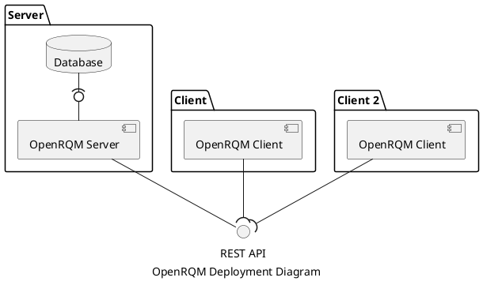

# OpenRQM System Architecture

This repository contains the architecture of the OpenRQM System.

- [OpenRQM System Architecture](#openrqm-system-architecture)
  - [System Overview](#system-overview)
  - [API specification](#api-specification)

## System Overview

The OpenRQM System contains of a server which exposes the OpenRQM REST API and several clients which use it.

The OpenRQM project specifies only the REST API and provides a server and client implementation to demonstrate it.

This way many different implementations can be created which are interoperable.

## API specification
